# Escola+ — Funcionalidades e telas

O Escola+ reúne num só app Android tudo o que alunos, responsáveis e professores usam no dia a dia,
gerenciado por um backoffice web na nuvem. As capturas do app são geradas a partir do código
(`./gradlew recordRoborazziDebug`) com dados de demonstração.

## App do aluno e do responsável

O responsável vê todos os filhos vinculados e troca entre eles no topo da tela inicial.

| Tela | O que mostra |
| --- | --- |
| Login | E-mail e senha; endereço do servidor configurável |
| Início | Média geral, frequência, tarefas pendentes, mensalidades em aberto, próximo evento, último comunicado e atalhos |
| Comunicados | Avisos gerais e da turma, com destaque "Importante" |
| Agenda | Provas, eventos e feriados com hora e local |
| Horário | Aulas da semana, com professor e sala; o dia atual marcado |
| Boletim | Notas dos 4 bimestres e média por disciplina |
| Frequência | Presença por disciplina, com alerta abaixo de 75% |
| Tarefas | A entregar e anteriores, com prazo |
| Cardápio | Refeições dos próximos 7 dias |
| Financeiro | Mensalidades pagas, em aberto e atrasadas; copiar código de pagamento |

| Login | Início | Comunicados |
| --- | --- | --- |
| 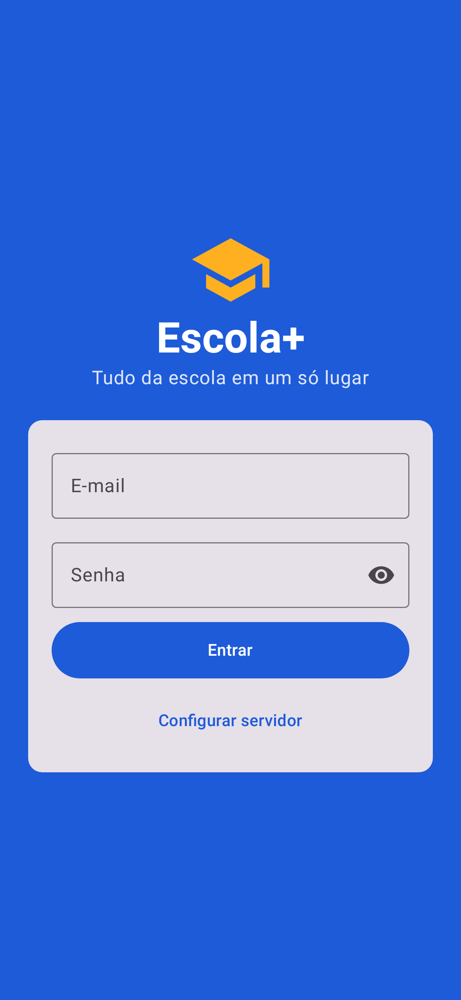 | 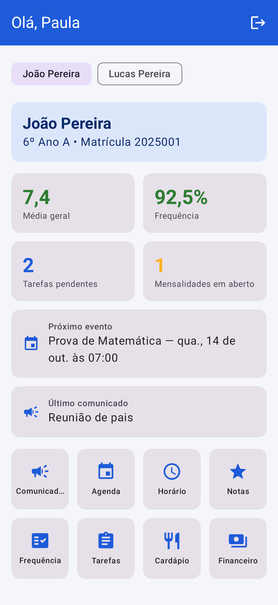 | 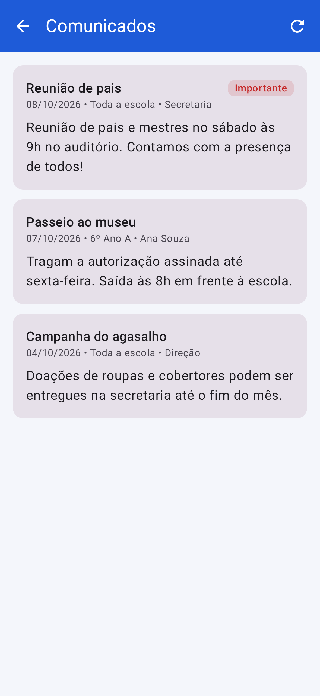 |
| **Agenda** | **Horário** | **Boletim** |
| 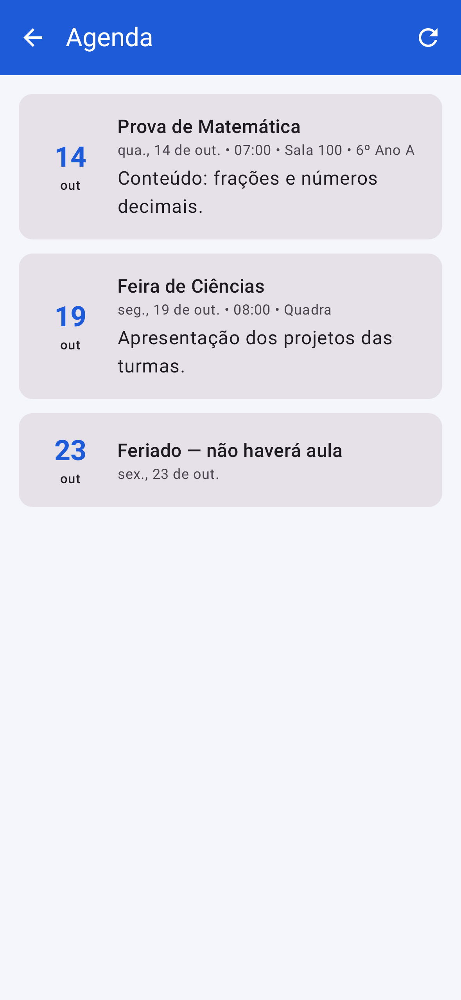 | 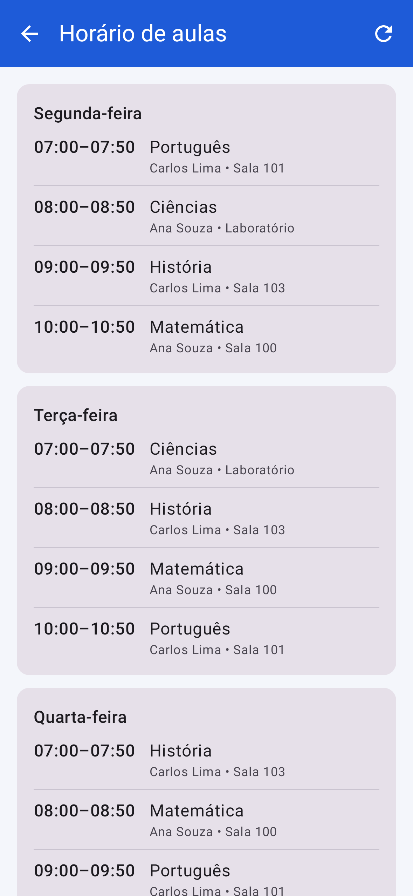 | 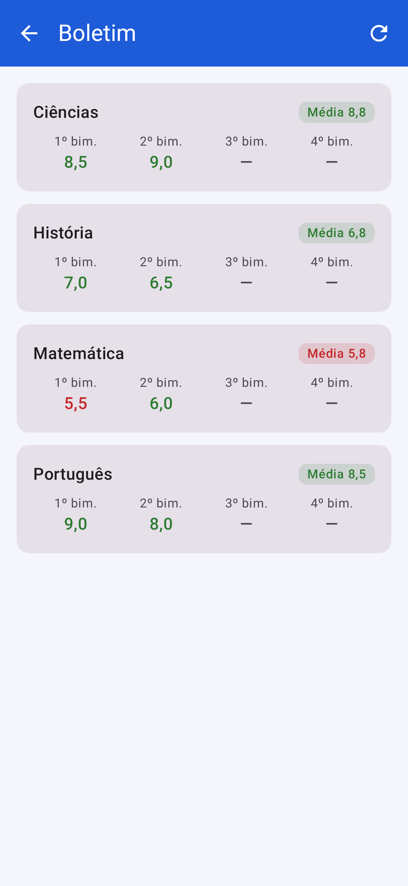 |
| **Frequência** | **Tarefas** | **Cardápio** |
| 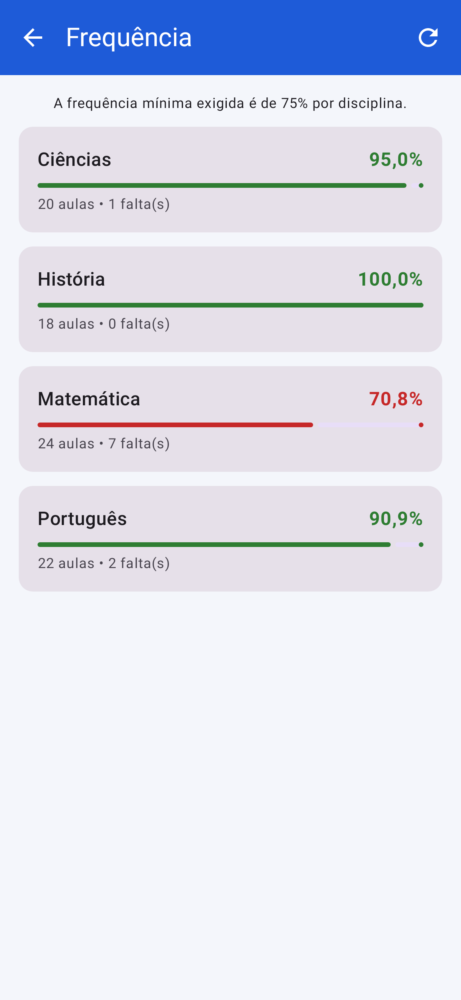 | 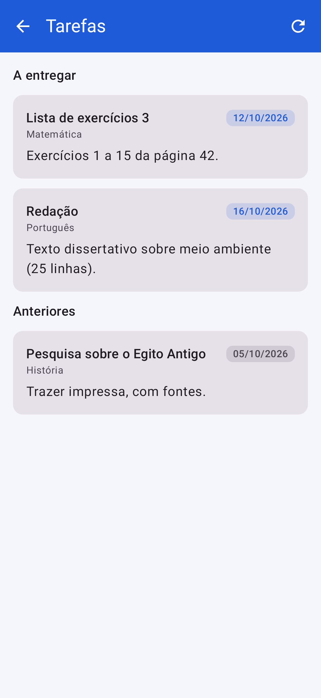 | 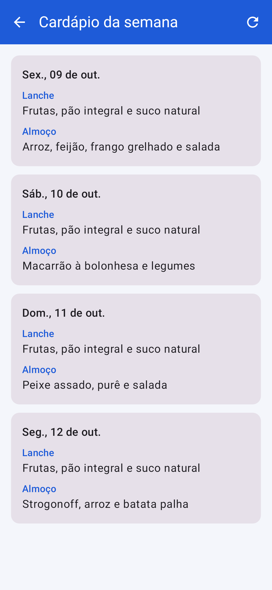 |
| **Financeiro** | | |
| 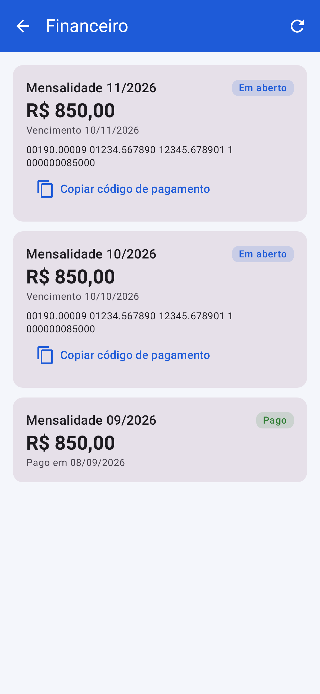 | | |

## App do professor

| Tela | O que faz |
| --- | --- |
| Início | Disciplinas e turmas com total de alunos |
| Chamada | Todos presentes por padrão; um toque marca falta; navega entre dias e corrige chamadas |
| Nova tarefa | Título, descrição e data de entrega |
| Novo comunicado | Publica aviso para uma das suas turmas |

| Início | Chamada | Nova tarefa | Novo comunicado |
| --- | --- | --- | --- |
| 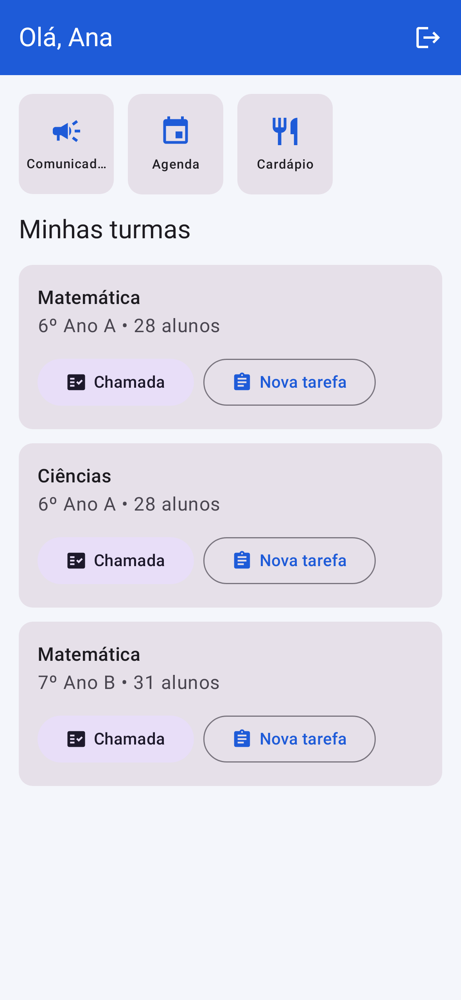 | 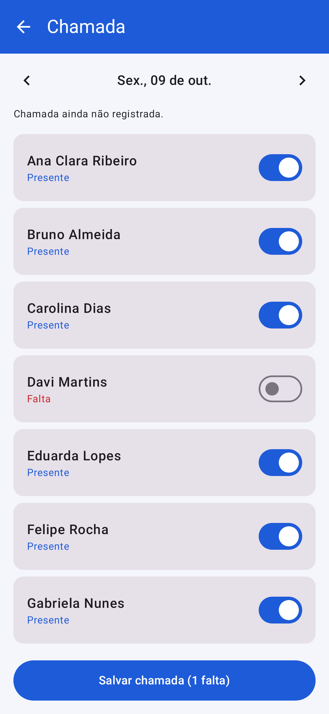 | 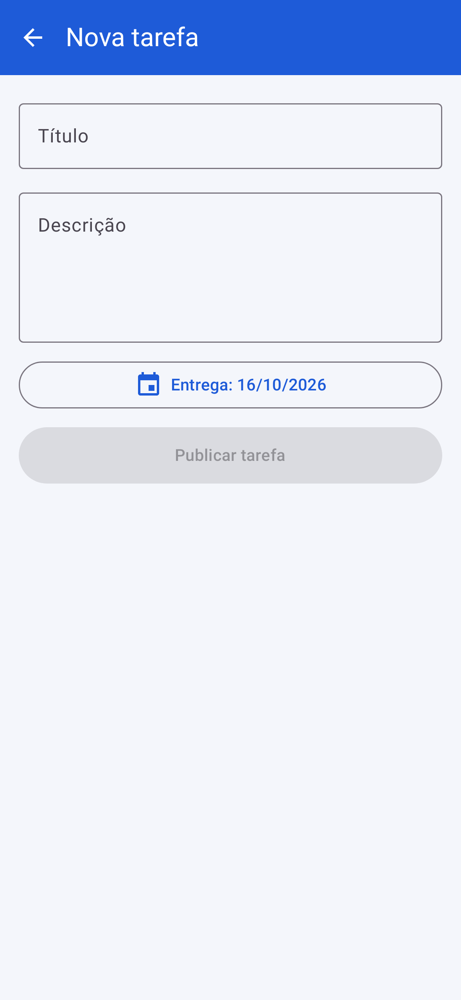 | 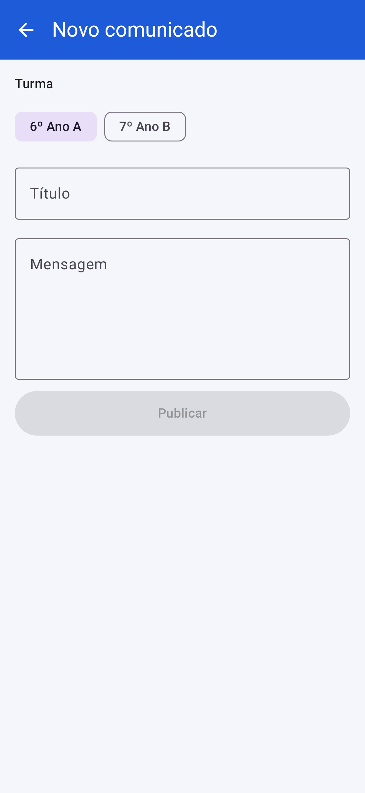 |

## Backoffice da secretaria

Painel com indicadores e cadastro de turmas, usuários, vínculos responsável↔aluno, disciplinas,
horários, comunicados, eventos, tarefas, notas, frequência, cardápio e mensalidades, com busca.

**Painel**

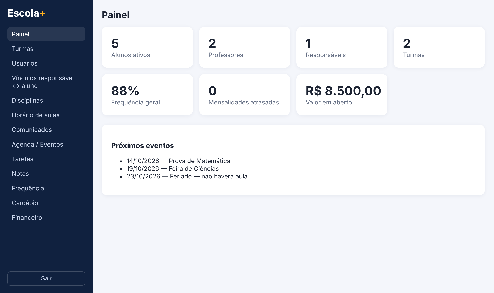

**Usuários**

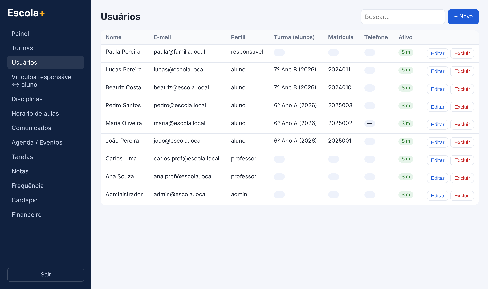

**Comunicados**

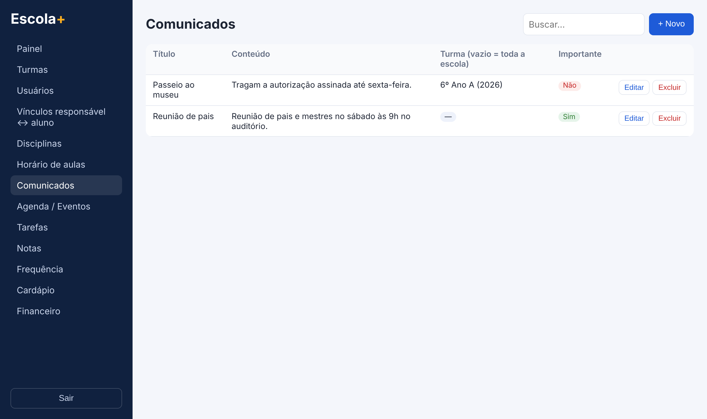

**Lançamento de nota**

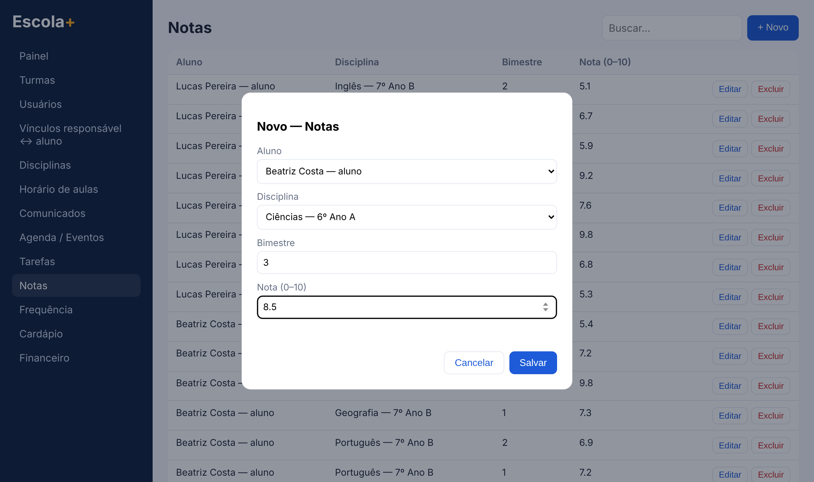

**Financeiro**

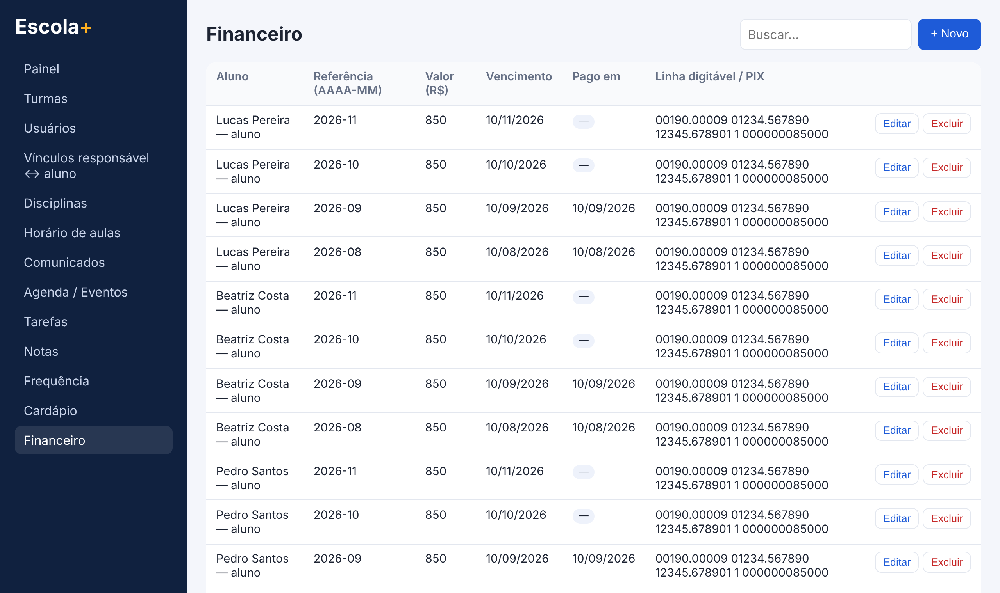
